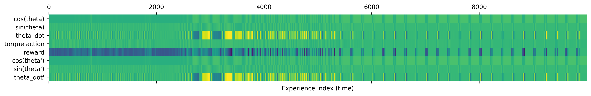

Trajectory collection for control tasks using online Soft Actor-Critic



Inspired by [Learning to Modulate pre-trained Models in RL](https://openreview.net/forum?id=aIpGtPwXny), code at https://github.com/ml-jku/L2M

To prepare the environment, run:

```
pip install 'gymnasium[other, classic_control]' torch
```
